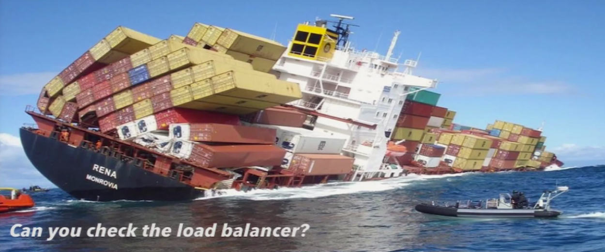
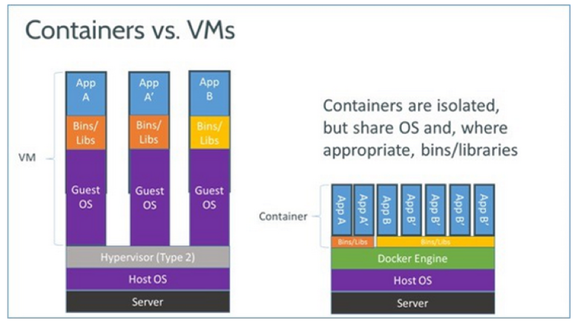
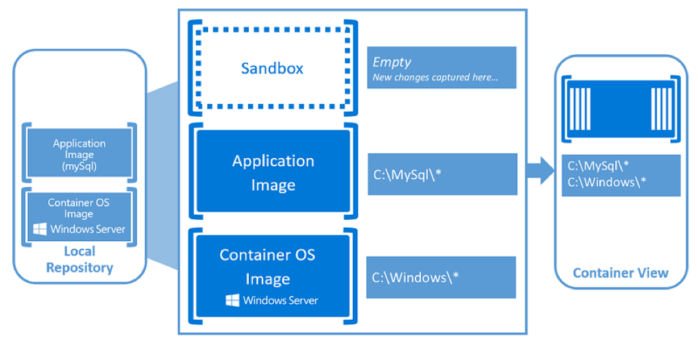

#Docker on Windows 

## Eine fortgeschrittene  Einführung

---


## Agenda für heute

* Container on Windows
    * Normal
    * Hyper-V
* Container in Azure
* Deploy simple Container on Windows Server
* Deploy more advanced Container
* Inspect image
* Networking - expose Services
* Kubernetes
* Deploy a complete image in Azure Container Services, Kubernetes and OMS
* Evtl. CoScale

---

## Container?



---

## Container on Windows


---

## Definition Container
A Container ...
* Is a solution to the problem of how to get software to run reliably when moved from one hardware to another
* Containers an application, plus all its dependencies, libraries and other files needed to run it
* Does not equal virtualization – but can use it (Hyper-V Containers)

--



--

## Definition MicroService
A MicroService ...
* Promotes a modular approach
* Is an application with a single function, such as routing network traffic, making an online payment or just providing a new GUID.
* Can run on a traditional Virtual Machine – but can also use the advantages of containers
* Is easy to replace
* Usually communicates through a web-based protocol and therefore can be hosted on any desired platform

---

## Docker Terms

* *Image* - A stateless collection of root filesystem changes in the form of layered filesystems stacked upon one another.
* *Container* - A runtime instance of an image consisting of the image, its execution environment, and a standard set of instructions.
* *Dockerfile* - A text file that contains the commands that need to be executed to build a Docker image.
* *Build* - The process of building Docker images from a Dockerfile and any other files in the directory where the image is being built.

---

## Problems with traditional Containers

* Not enough isolation: Shared Kernel
* Dependency on host OS version


---

## Solution: Hyper-V Containers

* Work like expected of a container
* Run inside a special type of virtual machine
* Provide kernel isolation between the containers
* Provide a kernel per container (Currently: Windows Only)


---

<!-- .slide: data-background="./img/4.png"  -->

---

 ## Other virtualization technologies

* Currently: Common conceptual ground, different content delivered
    * App-V & ThinApp: Virtualize Client Applications
    * RemoteApp & XenApp: Technically no virtualization required
    * Server App-V: Common grounds with containers
    * Containers: Server Applications & Services
* Future: Not so much difference anymore ... replacement?

---

<!-- .slide: data-background="./img/5.jpg"  -->

---

<!-- .slide: data-background="./img/6.jpg"  -->

---

#Deploy Containers in Azure

---

Two possibilities:
* Deploy it on a Windows Server 2016 Docker enabled Machine
* Deploy it on Azure Container Services (ACS)

---

# Deploy simple Container on Windows Server

---

* Based on sample Images (https://hub.docker.com/r/microsoft/dotnet-samples/)
* We choose .Net Core on Nano Server
* Image starts up, displays ASCII-Art
* And stops ...

Note: https://docs.microsoft.com/en-us/virtualization/windowscontainers/quick-start/quick-start-windows-server

---

## Docker File

```
FROM microsoft/dotnet:1.0-runtime-nanoserver
WORKDIR /app
COPY out .
ENTRYPOINT ["dotnet", "dotnetapp.dll"]
```

---

<!-- .slide: data-background="./img/8.jpg" -->
#Lab

---


# Deploy more advanced Container


---

## IIS

* We will deploy an IIS image
* Not so much different than before
* Port forwarding is new
    * Rule: Host - Container: Use virtual IP
    * Rule: External - Container: Use Host IP
    * Windows Server has some bugs ...
Note: https://docs.microsoft.com/en-us/virtualization/windowscontainers/quick-start/quick-start-images


---

# Inspect image
* Docker inspect
* See the layers (ProgramData ...)
* Diff 0: SHA256 is 5f70bf18a08a
* PowerShell into the image
* Stop the W3SVC
Note: PowerShell into Image docker exec
Note:  Stop w3svc
Note: Expose Website

---

<!-- .slide: data-background="./img/8.jpg" -->
#Lab

---

# Networking - expose Services

---

## Windows Container Networking

---

<!-- .slide: data-background="./img/11.png" -->

---

## Windows Container Network Drivers

* nat – containers attached to a network created with the 'nat' driver will receive an IP address from the user-specified (--subnet) IP prefix. Port forwarding / mapping from the container host to container endpoints is supported.
Note: Multiple NAT networks are now supported with Windows 10 Creators Update!
* transparent – containers attached to a network created with the 'transparent' driver will be directly connected to the physical network. IPs from the physical network can be assigned statically (requires user-specified --subnet option) or dynamically using an external DHCP server.
* overlay - New! when the docker engine is running in swarm mode, containers attached to an overlay network can communicate with other containers attached to the same network across multiple container hosts. Each overlay network that is created on a Swarm cluster is created with its own IP subnet, defined by a private IP prefix. The overlay network driver uses VXLAN encapsulation.
Note: Requires Windows Server 2016 with KB4015217 or Windows 10 Creators Update
* l2bridge - containers attached to a network created with the 'l2bridge' driver will be will be in the same IP subnet as the container host. The IP addresses must be assigned statically from the same prefix as the container host. All container endpoints on the host will have the same MAC address due to Layer-2 address translation (MAC re-write) operation on ingress and egress.
Note: Requires Windows Server 2016 or Windows 10 Creators Update
* l2tunnel - this driver should only be used in a Microsoft Cloud Stack

---

## ACS Networking

---

# Kubernetes

---

Cluster > Node > Pod > Container > Service

Design[edit]
Kubernetes defines a set of building blocks ("primitives") which collectively provide mechanisms for deploying, maintaining, and scaling applications. The components which make up Kubernetes are designed to be loosely coupled and extensible so that it can meet a wide variety of different workloads. The extensibility is provided in large part by the Kubernetes API, which is used by internal components as well as extensions and containers running on Kubernetes.[16]
Pods[edit]
The basic scheduling unit in Kubernetes is called a "pod". It adds a higher level of abstraction to containerized components. A pod consists of one or more containers that are guaranteed to be co-located on the host machine and can share resources.[16] Each pod in Kubernetes is assigned a unique (within the cluster) IP address, which allows applications to use ports without the risk of conflict.[17] A pod can define a volume, such as a local disk directory or a network disk, and expose it to the containers in the pod.[18] Pods can be manually managed through the Kubernetes API, or their management can be delegated to a controller.[16]
Labels and selectors[edit]
Kubernetes enables clients (users or internal components) to attach key-value pairs called "labels" to any API object in the system, such as pods and nodes[definition needed]. Correspondingly, "label selectors" are queries against labels that resolve to matching objects.[16]
Labels and selectors are the primary grouping mechanism in Kubernetes, and are used to determine the components to which an operation applies.[19]
For example, if the Pods of an application have labels for a system tier ("front-end", "back-end", for example) and a release_track ("canary", "production", for example), then an operation on all of the "back-end" and "canary" nodes could use a label selector such as the following:[20]
tier=back-end AND release_track=canary
Controllers[edit]
A controller is a reconciliation loop that drives actual cluster state toward the desired cluster state.[21] It does this by managing a set of pods. One kind of controller is a "Replication Controller," which handles replication and scaling by running a specified number of copies of a pod across the cluster. It also handles creating replacement pods if the underlying node fails.[21] Other controllers that are part of the core Kubernetes system include a "DaemonSet Controller" for running exactly one pod on every machine (or some subset of machines), and a “Job Controller” for running pods that run to completion, e.g. as part of a batch job.[22] The set of pods that a controller manages is determined by label selectors that are part of the controller’s definition.[20]
Services[edit]
A Kubernetes service is a set of pods that work together, such as one tier of a multi-tier application. The set of pods that constitute a service are defined by a label selector.[16] Kubernetes provides service discovery and request routing by assigning a stable IP address and DNS name to the service, and load balances traffic in a round-robin manner to network connections of that IP address among the pods matching the selector (even as failures cause the pods to move from machine to machine).[17] By default a service is exposed inside a cluster (e.g. back end pods might be grouped into a service, with requests from the front-end pods load-balanced among them), but a service can also be exposed outside a cluster (e.g. for clients to reach frontend pods)[23]
Architecture[edit]

Kubernetes architecture diagram
Kubernetes follows the master-slave architecture.The components of Kubernetes can be divided into those that manage an individual node and those that are part of the control plane.[16][24]
Kubernetes control plane[edit]
The Kubernetes Master is the main controlling unit of the cluster that manages its workload and directs communication across the system. The Kubernetes control plane consists of various components, each its own process, that can run both on a single master node or on multiple masters supporting high-availability clusters.[24] The various components of Kubernetes control plane are as follows:
etcd[edit]
etcd is a persistent, lightweight, distributed, key-value data store developed by CoreOS that reliably stores the configuration data of the cluster, representing the overall state of the cluster at any given point of time. Other components watch for changes to this store to bring themselves into the desired state.[24]
API server[edit]
The API server is a key component and serves the Kubernetes API using JSON over HTTP, which provides both the internal and external interface to Kubernetes.[16][25] The API server processes and validates REST requests and updates state of the API objects in etcd, thereby allowing clients to configure workloads and containers across Worker nodes.
Scheduler[edit]
The scheduler is the pluggable component that selects which node an unscheduled pod (the basic entity managed by the scheduler) should run on based on resource availability. Scheduler tracks resource utilization on each node to ensure that workload is not scheduled in excess of the available resources. For this purpose, the scheduler must know the resource requirements, resource availability and a variety of other user-provided constraints and policy directives such as quality-of-service, affinity/anti-affinity requirements, data locality and so on. In essence, the scheduler’s role is to match resource “supply” to workload “demand”. [26]
Controller manager[edit]
The controller manager is the process that the core Kubernetes controllers like DaemonSet Controller and Replication Controller run in. The controllers communicate with the API server to create, update and delete the resources they manage (pods, service endpoints, etc.)[25]
Kubernetes node[edit]
The Node also known as Worker or Minion is the single machine (or virtual machine) where containers(workloads) are deployed. Every node in the cluster must run the container runtime (such as Docker), as well as the below mentioned components, for communication with master for network configuration of these containers.
Kubelet[edit]
Kubelet is responsible for the running state of each node (that is, ensuring that all containers on the node are healthy). It takes care of starting, stopping, and maintaining application containers (organized into pods) as directed by the control plane.[16][27]
Kubelet monitors the state of a pod and if not in the desired state, the pod will be redeployed to the same node. The node status is relayed every few seconds via heartbeat messages to the master. Once the master detects a node failure, the Replication Controller observes this state change and launches pods on other healthy nodes.[citation needed]
Kube-proxy[edit]
The kube-proxy is an implementation of a network proxy and a load balancer, and it supports the service abstraction along with other networking operation.[16] It is responsible for routing traffic to the appropriate container based on IP and port number of the incoming request.
cAdvisor[edit]
cAdvisor is an agent that monitors and gathers resource usage and performance metrics such as CPU, memory, file and network usage of containers on each node.

---

# Deploy a complete image in Azure Container Services, Kubernetes and OMS


---

# Evtl. CoScale